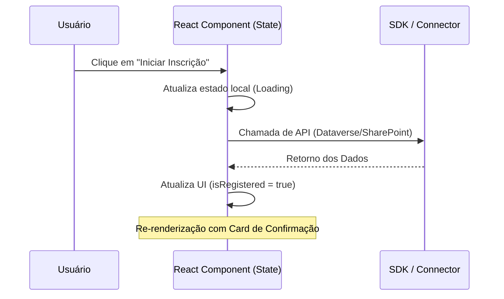

# 📊 Diagramas de Arquitetura - Hackathon Modernization

Este documento detalha visualmente a estrutura e as interações técnicas do projeto de modernização do app de Hackathon.

## 1. Arquitetura Geral do Sistema
Este diagrama ilustra como o componente React (Code App) é hospedado dentro do ambiente Power Platform e como ele se comunica com os serviços de dados.

```mermaid
graph TD
    User((Usuário)) --> PowerApps[Power Apps Host / Player]
    
    subgraph Runtime [Ambiente de Execução]
        PowerApps --> Container[React Code App Container]
        Container --> SDK[@microsoft/power-apps SDK]
    end

    subgraph Data [Camada de Dados]
        SDK --> Dataverse[(Dataverse)]
        SDK --> SP[(SharePoint Lists)]
    end

    style Container fill:#4D2240,color:#fff,stroke:#FFC638,stroke-width:2px
```

## 2. Arquitetura de Componentes (React)
A estrutura de renderização segue o padrão de composição do Fluent UI v9 e a hierarquia de provedores necessária para o Power Apps.

```mermaid
graph TD
    Root[main.tsx] --> Fluent[FluentProvider: webDarkTheme]
    Fluent --> Power[PowerProvider: SDK Context]
    Power --> App[App.tsx: Logic & Orchestration]
    
    subgraph UI_Layout [Layout Principal]
        App --> Card[Card: Glassmorphism]
        Card --> Header[Avatar & Title]
        Card --> Content[Subtitle & Badge]
        Card --> Actions[ButtonContainer]
        Actions --> PriBtn[Primary: Iniciar Inscrição]
        Actions --> SecBtn[Secondary: Pré-requisitos]
    end

    style Card fill:rgba(0,0,0,0.7),stroke:#fff,stroke-dasharray: 5 5
```

## 3. Fluxo de Estado e Dados
O gerenciamento de estado utiliza React Hooks para controle de fluxo unidirecional.



## 4. Diagrama de Dependências e Stack Tecnológico
Visualização das tecnologias core e como elas se relacionam no ecossistema do projeto.

```mermaid
graph LR
    subgraph Core_Stack [Stack Tecnológico]
        React[React 18] --- TS[TypeScript 5]
        Vite[Vite 6] --- Build[Bundle Prod]
    end

    subgraph UI_Stack [Design System]
        FluentUI[Fluent UI v9] --- Icons[Fluent Icons]
    end

    subgraph Platform [Integração]
        SDK[@microsoft/power-apps] --- PAC[Power Platform CLI]
    end
```

---
**Documentação gerada para suporte à arquitetura NTT DATA.**